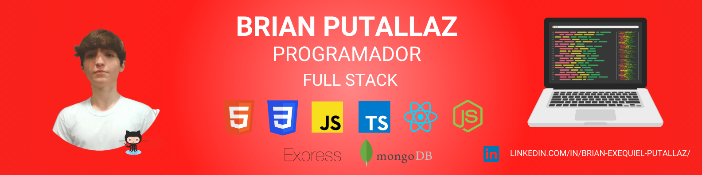

<h1 align="center">Hola 👋, Soy Brian</h1>
<h3 align="center">Título del Proyecto</h3>

<!-- <h3 align="left">Título y a continuación descripción</h3> -->

<!-- Título y Descripción: Proporciona un título descriptivo y una breve descripción de tu proyecto. Esto ayuda a los visitantes a comprender rápidamente de qué trata tu proyecto.

Instrucciones de instalación: Si tu proyecto es una biblioteca, una aplicación o cualquier cosa que deba ser instalada, proporciona instrucciones claras y concisas sobre cómo instalar y configurar el entorno de desarrollo necesario.

Ejemplos o Demostraciones: Si es posible, incluye ejemplos o demostraciones de tu proyecto en acción. Esto puede ser en forma de capturas de pantalla, gifs animados o enlaces a sitios web o aplicaciones en vivo.

Documentación: Si tu proyecto es lo suficientemente grande o complejo, es útil proporcionar una sección de documentación donde puedas explicar en detalle cómo funciona tu proyecto, cómo usarlo y cualquier otra información relevante.

Requisitos: Si tu proyecto tiene requisitos específicos, como versiones de lenguajes de programación o bibliotecas, menciona estos requisitos para que los usuarios puedan asegurarse de cumplirlos antes de usar tu proyecto.

Contribución: Si deseas que otros colaboren en tu proyecto, incluye una sección de contribución donde describas cómo pueden ayudar, los pasos para contribuir y cualquier guía de estilo o estándares de codificación que deban seguir.

Licencia: Es importante mencionar la licencia bajo la cual se distribuye tu proyecto. Esto proporciona a los usuarios claridad sobre cómo pueden utilizar tu código.

Estado del Proyecto: Si tu proyecto está en desarrollo activo, en fase beta o se considera estable, es útil incluir una sección que indique el estado actual del proyecto y cualquier plan a futuro.

Contacto: Proporciona información de contacto, como tu dirección de correo electrónico o enlaces a tus perfiles de redes sociales, para que los usuarios puedan comunicarse contigo si tienen preguntas o comentarios sobre tu proyecto. -->

- 👨‍💻 Todos mis proyectos están disponibles en: [https://github.com/BrianPutallazExequiel](https://github.com/BrianPutallazExequiel)

- 📫 ¿Cómo contactarme? **brianexequielputallaz@gmail.com**

<h3 align="left">Connect with me:</h3>

<h3 align="left">Languages and Tools:</h3>

           
